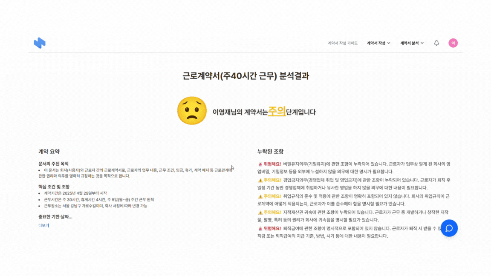
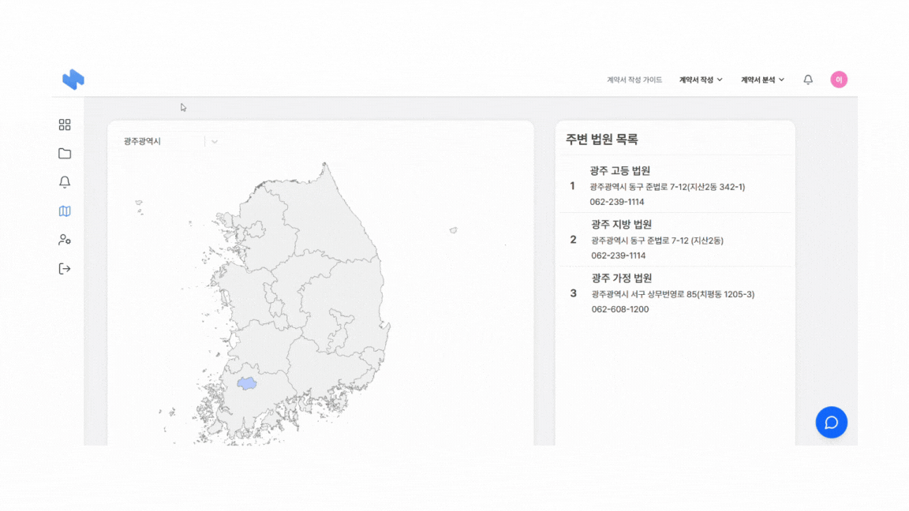

# 📝 CHECKMATE(체크메이트) - 계약서 분석 및 작성 지원 플랫폼

  

---

## 📚 목차
1. [🧭 프로젝트 소개](#프로젝트-소개)
2. [🎯 주요 화면 및 기능 소개](#주요-화면-및-기능-소개)
3. [🔧 개발 환경](#개발-환경)
   - [🖥️ 기술 스택](#기술-스택)
   - [📊 ERD](#erd)
   - [📦 아키텍처](#아키텍처)
   - [🖼️ 와이어프레임](#와이어프레임)
4. [👥 팀원 소개](#팀원-소개)

---

## 🧭 프로젝트 소개

- **서비스 명**: CHECKMATE(체크메이트)
- **소개**: SSAFY 12기 2학기 자율 프로젝트
- **기간**: 2025.04.14 ~ 2025.05.22 (39일)
- **기획 배경**:  
  사회 초년생들이 불공정한 계약을 피할 수 있도록, 계약서 작성 및 분석을 지원하는 서비스 제공

 

# 🎯 주요 화면 및 기능 소개

#### 메인화면

- 체크메이트 서비스를 설명하는 내용으로 구성
- 페이지의 최하단에는 네이버 뉴스 API를 이용하여 계약 관련된 뉴스를 제공
- 네이버 뉴스를 Redis에 캐싱하여 API 호출

#### 계약서 분석

- 계약서 유형을 선택하면 업로드 할 수 있는 페이지로 전환
- 업로드 페이지에서 HWP, PDF, JPG, PNG 확장자의 계약서를 업로드 할 수 있고, 업로드 되면 ClamAV를 통해 바이러스 검사 진행
- 안전한 파일인게 확인되면 AES-GCM 암호화 하여 DEK를 이용해 2-of-2 방식으로 각기 다른 데이터베이스에 분산 저장장

- 분석이 완료되면 WebSocket+Stomp를 이용하여 실시간 알림을 제공
- 분석 결과는 LangChain에 OpenAPI를 이용하여 비동기 병렬형태로 진행
- 분석 프롬프트는 RAG를 이용하여 사전 저장된 Qdrant 법률 데이터를 이용하여 벡터 조회를 통해 나온 결과를 프롬프트에 증강하여 신뢰성과 안정성 증가

#### 계약서 작성 가이드

- 계약서를 작성할 때, 어떤 순서로 작성을 하면 되는지에 대한 가이드 페이지

#### 계약서 작성 전 주의사항

- 계약서 작성 전 주의사항을 모달창으로 제공

#### 계약서 작성

- 카테고리 별 계약서 템플릿을 제공하여 사용자가 필드에 값을 채우면 계약서를 제공
- 자동저장 기능을 통해 이전에 작성한 내용도 쉽게 확인

#### 마이페이지

- 마이페이지의 대시보드에는 계약 활동, 알림, 최근 활동 내역을 제공
- 내 계약서 탭으로 이동하면 사용자가 진행했던 계약서 관련 상태를 확인
- d3.js를 통해 지도를 시각화하여 렌더링하는 시간을 감소

#### 계약서 저장

- 저장하기 버튼을 누르면 pdf형태로 사용자에게 제공

#### 전자서명
- DropSignAPI를 이용하여 전자서명 구현

 

# 👻 개발 환경

## 기술스택

### Frontend

  
  
  

### Backend

  
  
  
  
  

### AI

  
  
  

### Database

  
  
  
  

### Infra/DevOps

  
  
  
  
  

### 협업 툴

  
  

### 📊 ERD

### 📦 아키텍처

### 🖼️ 와이어프레임(클릭시 이동)

 

## 👥 팀 구성

<table>
  <tbody>
    <tr align="center">
      <td> </td>
      <td> </td>
      <td> </td>
      <td> </td>
      <td> </td>
      <td> </td>
    </tr>
    <tr align="center">
      <td width="200"><a href="http://github.com/yj901010">팀장 : 이영재 INFJ</a></td>
      <td width="200"><a href="http://github.com/hjkim2040">팀원 : 김성찬 ISFP</a></td>
      <td width="200"><a href="https://github.com/sonseohy">팀원 : 손서현 ISTP</a></td>
      <td width="200"><a href="https://github.com/tytomko">팀원 : 고태연 ENTJ</a></td>
      <td width="200"><a href="https://github.com/songowen">팀원 : 송창현 ISTP</a></td>
      <td width="200"><a href="https://github.com/newww-a">팀원 : 신승아 ENFP</a></td>
    </tr>
    
  </tbody>
</table>

 
